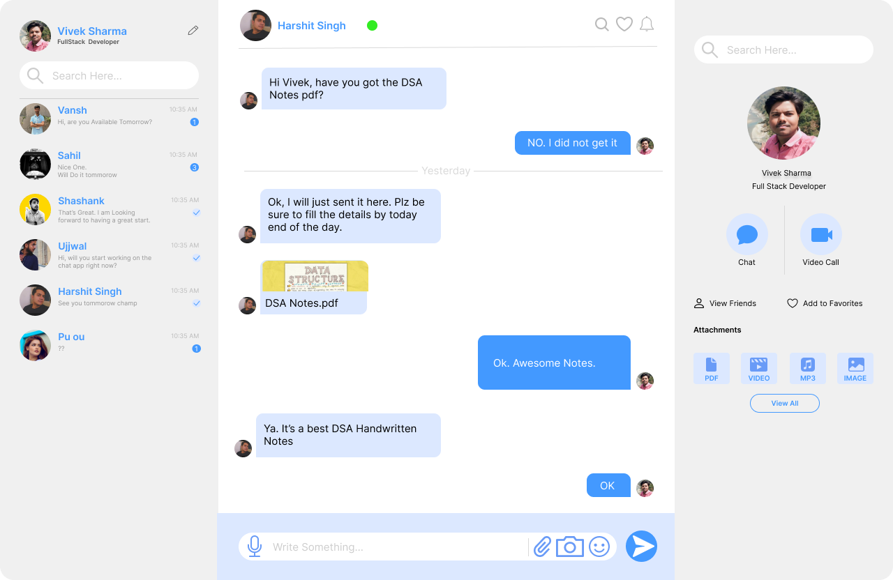
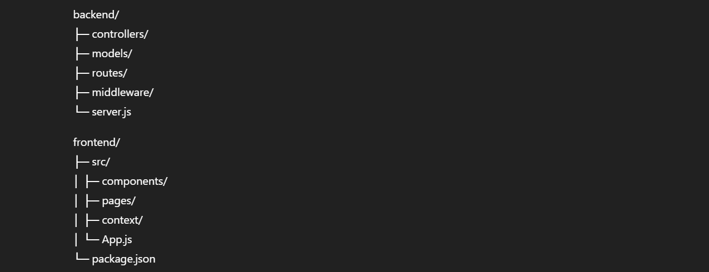

# 💬 Real-Time Chat Application

**Tech Stack:** `React.js` | `Node.js` | `Express.js` | `MongoDB` | `Socket.IO` | `JWT` | `Tailwind CSS` | `Framer Motion`  

A **real-time chat application** designed for instant messaging, group chats, and user management, focusing on **performance, security, and user experience**. This project demonstrates **full-stack development skills**, including real-time communication, authentication, and admin dashboard analytics.

---

## 🚀 Features

### **Core Features**
- 💬 **Real-time messaging:** Instant communication with `Socket.IO`.  
- ✍️ **Typing indicators:** Shows when users are typing.  
- 🟢 **Online status:** Tracks who is currently online.  
- 👥 **Group chats:** Create/manage groups with proper validation.  
- 🤝 **Friend requests:** Send, accept, and manage connections.  
- 🔒 **JWT Authentication:** Secure login and protected routes.  

### **Performance Enhancements**
- ♾️ **Infinite scrolling:** Loads messages in chunks for optimized performance.  
- ⚡ **Optimized database queries:** Fast response and minimal server load.  

### **Admin Dashboard**
- 📊 **User analytics:** View active users and chat activity.  
- 📈 **Message insights:** Visualize message activity per chat/group.  
- 📉 **Charts integration:** Interactive charts for quick insights using `Chart.js` or `Recharts`.

---

## 🛠 Tech Stack & Tools
| Frontend | Backend | Database | Other Tools |
|----------|---------|---------|------------|
| React.js | Node.js | MongoDB | Socket.IO |
| Tailwind CSS | Express.js | JWT | Framer Motion |
| Framer Motion | | | Chart.js / Recharts |

---

## 📸 Screenshots 

- Login / Registration page  
- Chat interface (real-time messaging & typing indicators)  
- Group chat creation & member management  
- Admin dashboard with analytics  

> Optionally, link to a live demo:  
> [Live Demo](https://chatklr.netlify.app/)

---

## 📂 Project Structure

---

## 💻 How to Run Locally
1. **Clone the repository**  
git clone https://github.com/Vivek87077/WeChat.git
cd real-time-chat-app

2. **Setup backend**
cd backend
npm install
npm run dev

3. **Setup frontend**
cd frontend
npm install
npm start

4. **Access the app**
- Frontend: http://localhost:3000
- Backend API: http://localhost:5000

Ensure MongoDB is running locally or configure your .env for cloud MongoDB.

## 🎯 Challenges & Learning 
- Implemented real-time chat with Socket.IO handling concurrent users.
- Learned chunked message loading for infinite scrolling.
- Built secure authentication using JWT for protected routes and friend management.
- Developed interactive admin dashboard for data visualization.
- Enhanced skills in full-stack development, UI/UX, and performance optimization.

## 📈 Future Improvements
- Add message reactions & emojis
- Implement media sharing (images, files)
- Improve mobile responsiveness & PWA features
- Add push notifications for offline users

## 👨‍💻 Author
- **Name**: **VIVEK SHARMA**
- **GitHub**: Vivek87077
- **LinkedIn**: https://www.linkedin.com/in/viveksm3tv/
